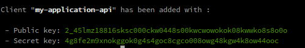

# Usage

## Generate a client

+ Go on the project root 

```ShellSession
cd /var/www/html
```

+ Execute the following command

```ShellSession
php app/console meup:oauth-server:create-client
```


The command will create the client in database and return yours keys for Oauth2 authentication



**Keep these keys in a safe place,they are yours identifiers for Oauth2 authentication!!!**